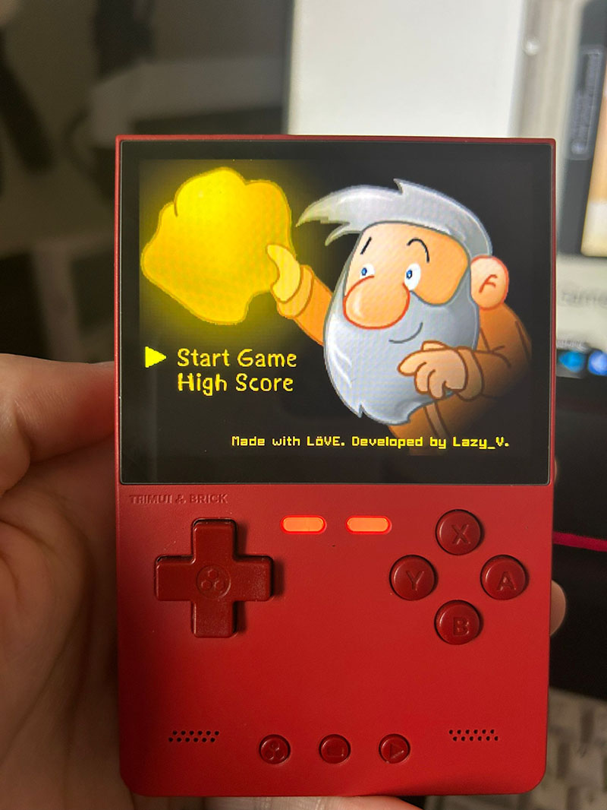
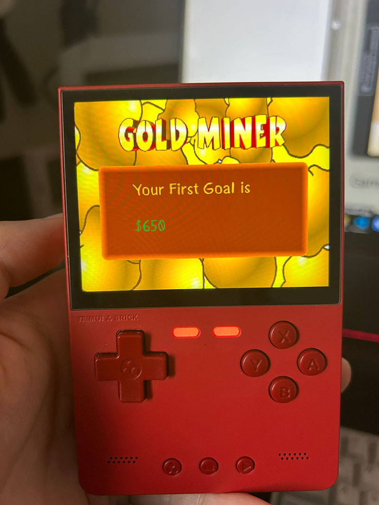
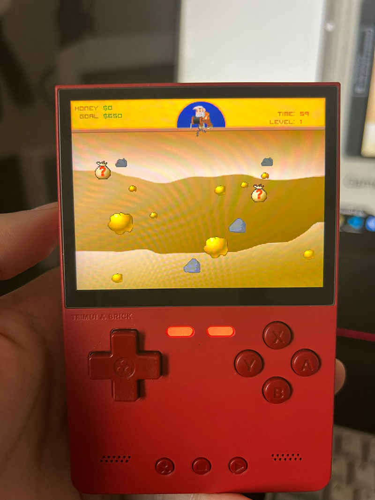

# GoldMiner-Rebirth

The classic game remake. Build for GameShell, Trimui (Smart Pro and Brick) and other LOVE2D compatible gaming handheld devices. Made with [LÖVE](https://love2d.org/)(11.1).

Download the latest Release [here](https://github.com/zzxzzk115/GoldMiner-Rebirth/releases/latest).

This game is available on the [PortMaster](https://portmaster.games/index.html) platform (Source can be found [here](https://github.com/PortsMaster/PortMaster-New/tree/main/ports/goldminer)). Many thanks to [JanTrueno](https://github.com/JanTrueno)!

## How to play

| Action                                                       | GameShell, Trimui & others | PC             |
| ------------------------------------------------------------ | -------------------------- | -------------- |
| Exit the game                                                | Menu button                | Escape         |
| Menu Confirm or Buy items                                    | A/B button or Start button | Enter          |
| Throw a dynamite                                             | X/Y button or D-pad Up     | Up             |
| Release the hook                                             | A/B button or D-pad Down   | Down           |
| Exit the current level when you reach the goal or Confirm shopping | Select button              | Space          |
| Select the shop item                                         | D-pad Left and Right       | Left and Right |

## Screenshots

## Photos

### GameShell

### Trimui Brick (RED)

## 3rd

- [hump](https://github.com/vrld/hump) and [lume](https://github.com/rxi/lume) for utility functions.
- [push](https://github.com/Ulydev/push) for resolution-handling.
- [tick](https://github.com/bjornbytes/tick) for a custom tick-rate.

## Release Notes

Checkout release notes [here](./ReleaseNotes.md).

## Project status

Checkout project status [here](https://github.com/zzxzzk115/GoldMiner-Rebirth/projects/1).

## License

This project's codes are licensed under the [MIT](./LICENSE) license.

Origin assets are from Internet, I modified them.
